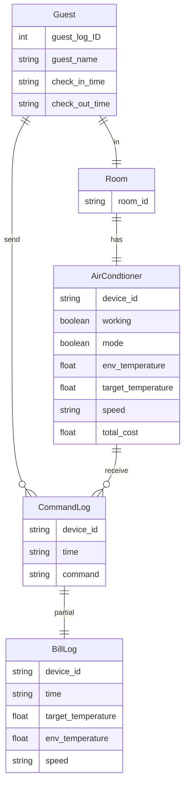

```mermaid
erDiagram
    Guest{
        int guest_log_ID
        string guest_name
        string check_in_time
        string check_out_time
    }
    Room {
        string room_id
    }
    Guest ||--|| Room : in

    AirCondtioner {
        string device_id
        boolean working
        boolean mode 
        float env_temperature
        float target_temperature
        string speed
        float total_cost
    }
    Room ||--|| AirCondtioner : has

    CommandLog {
        string device_id
        string time
        string command
    }

    Guest ||--o{ CommandLog : send
    AirCondtioner ||--o{ CommandLog : receive

    BillLog {
        string device_id
        string time
        float target_temperature
        float env_temperature
        string speed
    }

    CommandLog ||--|| BillLog : partial
```